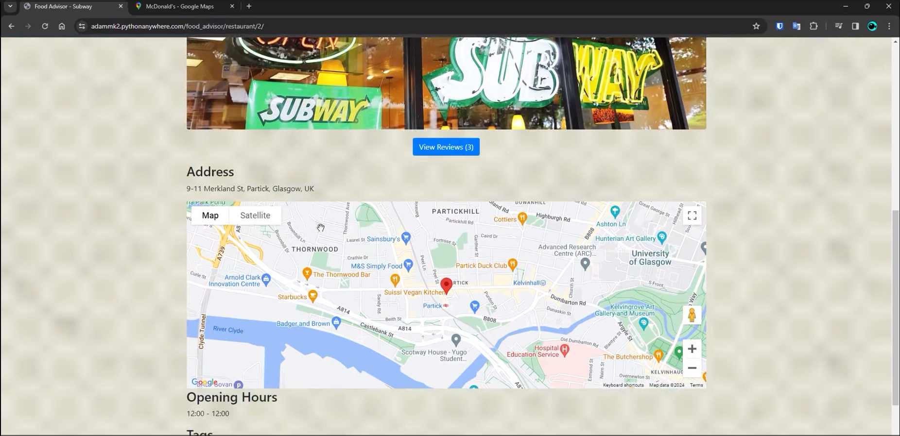

# Restaurant Review App
https://adammk2.pythonanywhere.com/

## Overview

The Restaurant Review App is a full-stack web application built with Django, designed to provide users with an interactive platform to explore and review restaurants. Whether you're a restaurant owner, a registered user, or just browsing without an account, this app offers unique features for each type of user.

### Key Features:
- **Browse Restaurants**: View a list of all available restaurants, complete with a filtering option to narrow results by cuisine.
- **Restaurant Pages**: Each restaurant has its own dedicated page with reviews, location details (including an interactive map), menu, and additional information.
- **User Accounts**: 
  - **Regular Users** can log in to write a single review per restaurant.
  - **Restaurant Owners** can manage their restaurant's page and update details like menu and location.
  - **Guest Access** is available for browsing restaurants without logging in.

## User Roles

- **No Account**: As a guest, users can browse restaurants and view detailed information, including reviews and location.
- **User Account**: Users can sign in to write reviews, limited to one per restaurant, and have access to other features, such as saving favorite restaurants.
- **Owner Account**: Restaurant owners can sign in to manage their restaurant pages, including updating restaurant details, menu, and responding to reviews.

## App Features

1. **Main Window**: Displays a list of all restaurants with a filter for cuisine type, making it easy for users to find exactly what they're looking for.
   
   

2. **Restaurant Creation**: 
   - Click on a restaurant owner to view its page, which includes:
     - Creation of restaurant, including location, menu and other details.
   
   

3. **User Reviews**: 
   - Signed-in users can leave one review per restaurant.
   - Reviews are publicly visible to help others make dining decisions.
   
   

4. **Restaurant Management**: 
   - Owners can sign in to manage their restaurant page, including updating the restaurant's menu, location, details and responding to reviews.
   
   

5. **User Reviews**: 
   - Each user can look at other reviews.
   
   
